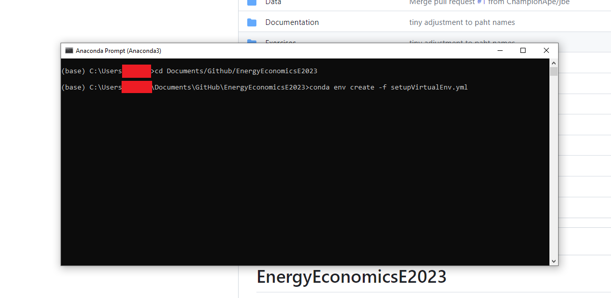
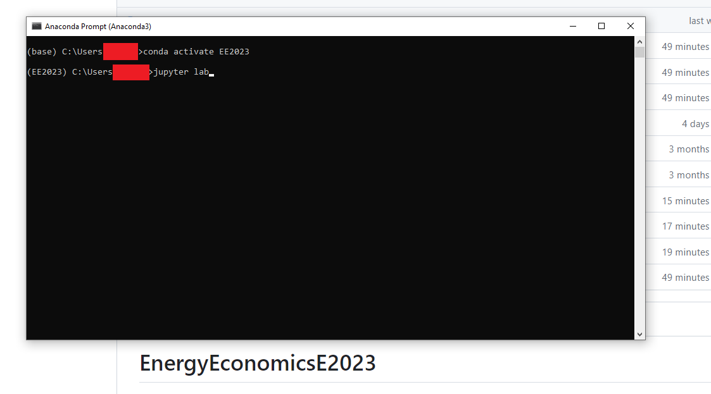

# EnergyProject
Repository for EEGT "Danish Energy Islands" Project by Hasselwander, Erenbjerg and Roach. 

Note: to run this you NEED git LFS. Download and set up instructions here: https://git-lfs.com/


## Installation guide:
The models require installation of Python (e.g. through Anaconda), some type of git tool (e.g. Github Desktop, Git, Tortoise), and an editor for python code (e.g. VSCode or Sublime). The course *Introduction to Programming and Numerical Analysis* provides some pretty detailed guides for setting up Python and VSCode: https://numeconcopenhagen.netlify.app/guides/. We do, however, rely on different packages and a slightly different setup. The following is a simple installation guide:
* Install Anaconda distro (but can get away with coda)
* Clone to preferred folder
* Open "Anaconda Prompt" ("Terminal for Mac) and navigate to cloned repo folder (using ``cd``).
* Install virtual environment writing: ```conda env create -f setupVirtualEnv.yml``` (You have to press ```y+enter``` to proceed afterwards).
  

### Opening/running the project
You now have a .venv (virtual environment) that runs the project materials.;
To run project files, open Anaconda Prompt (or Terminal for Mac), navigate to the project folder again (using cd) and run ```conda activate EEProject```. Then, you can open e.g. the Jupyter Lab that exercises are written in by calling  ```jupyter lab```.

The project folder is located in source (src) folder, then project/project.ipynb. 


*Note: You have to keep this prompt/terminal open as long as you work in your notebook.*
